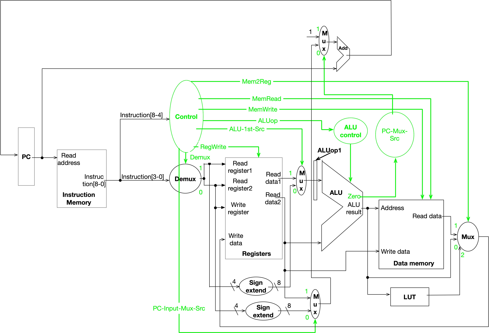

# ComputerArchitecture
Design an instruction set and overall architecture (ISA) for a special-purpose reduced instruction set (RISC) processor. Design the hardware for the processor core. 

# Project

- Design the instruction set and overall architecture (ISA) for your own special-purpose reduced instruction set (RISC) processor. Including:
  - Instruction set
  - Instruction format
  - Register amount (general-purpose or specialized?)
  - Addressing modes supported 
  - Constraints:
    - All internal data paths and storage will be 8 bits wide 
    - Conventional main memory of 256 bytes (8-bit address pointer)
- Your desgin should be optimized for three simple programs.
  - Program 1: Encrypter. Encrypt the message provided by users using a 7 bits Linear feedback shift registers (LFSR). Check [my note about LFSR here](img/mynote_LFSR.png).
  - Program 2: Decrypter. By examining the first 15 bytes of the message, figure out the seend (initial value) of the LFSR and its feedback pattern. Then decrypt the encrypted message. 
  - Program 3: Error Detection. Make use of the parity bit to detect error existence. 

- Design the hardware for your processor core.
- Design the assembler. 
  - Translate the assemble program writing in my designed ISA to machine code according to my designed hardware.

(More detials plz check out [doc/project_requirement.md](doc/project_requirement.md))

# My overall steps:
1. Implement these 3 programs using common assembly language, like MIPS/ARM.
2. Count how many operations/instructions are needed.
3. Classify those operations/instructions: S type, R-R type, I-R type, Mem type, BI type and Independent type. 
4. Design instructions format, how to split 9 bits, ISA (instructions set architecture).
5. Design hardware, including datapath, control signals.
6. Rewrite 3 programs using our designed instructions in step 4, replace those instructions in step 1.

## Step 1: Implement these 3 programs using common assembly language, like MIPS/ARM.

[pseudocode_program1](doc/pseudocode_program1.txt)

[pseudocode_program2](doc/pseudocode_program2.txt)

[pseudocode_program3](doc/pseudocode_program3.txt)

## Step 2 & 3 & 4: Design our ISA.

### Look Up Table
|Index |Contents|
|-|-|
|0|110 0000|
|1|100 1000|
|2|111 1000|
|3|111 0010|
|4|110 1010|
|5|110 1001|
|6|101 1100|
|7|111 1110|
|8|111 1011|
||

### Registers (4 bits):

|Register name|Binary|Purpose|
|-|-|-|
|r0|0000|General purpose|
|r1|0001|General purpose|
|r2|0010|General purpose|
|r3|0011|General purpose|
|s0|0100|General purpose but usually for variables with long lifetime |
|s1|0101|General purpose but usually for variables with long lifetime |
|s2|0110|General purpose but usually for variables with long lifetime |
|s3|0111|General purpose but usually for variables with long lifetime |
|s4|1000|General purpose but usually for variables with long lifetime |
|s5|1001|General purpose but usually for variables with long lifetime |
|s6|1010|General purpose but usually for variables with long lifetime |
|s7|1011|General purpose but usually for variables with long lifetime |
|s8|1100|General purpose but usually for variables with long lifetime |
||

### Format (for all instructions) :
|[8-4], 5 bits|[3-0], 4 bits|
|-|-|
|opcode|One of 16 registers, or an immediate number (from 0 to 15).|

### Instructions Classification:

|Classifications|Features|Examples
|-|-|-|
|S type (special)||OPTR|
|R-R type (Two operators are Register and Register)|They have 2 operators. Use 2 instructions together to finish one operation. The first operator is always a register. The second  operator is always a register.|All others|
|I-R type  (Two operators are Immediate number and Register)|They have 2 operators. Use 2 instructions together to finish one operation. The first operator is always an immediate number. The second  operator is always a register.|MOVI, ADDI, SUBI|
|Mem type|They have 2 operators. Use 2 instructions together to finish one operation. Need data_mem.|LOADB, STOREB|
|BI type (Branch with imme type)|They have 2 operators. Use 2 instructions together to finish one operation.  But the first operator is a register and the second operator is an immediate number.|BNZI, BZI, BLEZI|
|Independent Type|1 instruction can finish one operation.|J, JI, LUT|
||

### Instructions Table

|Instruction|Opcode|Type|Example|Meaning|
|-|-|-|-|-|
|OPTR|0 0001|S|OPTR r1 ADD r2 |This instruction indicates which register will be used as the first operator for the next instruction. It should be very carefully used before branching. The example means r2=r1+r2.|
|OPTR_imm|1 1000|S|OPTR_imm 3 ADDI	r0|This instruction indicates which immediate number will be used as the first operator for the next instruction. The example means r0=3+r0.|
|MOV 	|0 0010|R-R|OPTR	r0 MOV 	r1|r1=r0. Copy the value of r0 to r1.|
|ADD|0 0011|R-R|OPTR	r0<vr/>ADD	r1|r1 = r0 + r1. |
|SUB|0 0100|R-R|OPTR	r0 SUB	r1|r1 = r0 - r1. |
|DIV|0 0101|R-R|OPTR	r0 DIV	r1|r1=r0/r1. Divide r0 using r1 and store the remainder into r1. |
|AND|0 0110|R-R|OPTR	r0 AND	r1|r1 = r0 AND r1. The result of 0111 1111 AND 1010 0101 is 0010 0101.|
|OR|0 0111|R-R|OPTR	r0 OR	r1|r1 = r0 OR r1. The result of 0111 1111 OR 1010 0101 is 1111 1111.|
|XOR|0 1000|R-R|OPTR	r0 XOR	r1|r1 = r0 bitwise XOR r1. The result of 0111 1111 XOR 1010 0101  is 1101 1010. 0111 1111 ^ 1010 0101 = 1101 1010.|
|XORBIT|0 1001|R-R|OPTR		r0 XORBIT	r1|Reduction XOR all bits of r0 self and store the result into r1. The result of XORBIT 01010101 is 0. ^01010101 = 0.|
|SL		|0 1010|R-R|OPTR	#imme SL	r0|shift left reg r0 with #imme bits. 0<=#imme<=15. |
|BNZ		|0 1011|R-R|OPTR	r0 BNZ	r1|Branch to the instruction address PC=PC+ r1 value  if r0!=0. |
|BZ		|0 1100|R-R|OPTR	r0 BZ	r1|Branch to the instruction address PC=PC+r1 value if r0==0. |
|MOVI|0 1101|I-R|OPTR	#imme MOVI	r0|r0=#imme where 0<=#imme<=15. Store the immediate number into register r0.|
|ADDI|0 1110|I-R|OPTR	#imme ADDI	r0|r0 = r0 + #imme. 0<=#imme<=15.|
|SUBI|0 1111|I-R|OPTR	#imme SUBI	r0|r0 = r0 - #imme. 0<=#imme<=15.|
|LOADB	|1 0000|Mem|OPTR		r0 LOADB	r1|Load 1 byte from data_mem[value in r0] and store into reg r1. r1=data_mem[r0].|
|STOREB	|1 0001|Mem|OPTR		r0 STOREB	r1|Store 1 byte from reg r1 to data_mem[value in r0]. data_mem[r0]=r1. R0 value is address.|
|BNZI		|1 0010|BI|OPTR	r0 BNZI	#imme|Branch to the instruction address PC=PC+#imme if r0!=0. 0<=#imme<=15. |
|BZI		|1 0011|BI|OPTR	r0 BZI	#imme|Branch to the instruction address PC=PC+#imme if r0==0. 0<=#imme<=15. |
|BLEZI		|1 0100|BI|OPTR	r0 BLEZI	#imme|Branch to the instruction address PC=PC+#imme if r0<=0. 0<=#imme<=15. |
|LUT		|1 0101|Inde|OPTR	r0 LUT	r1		|For r0, 0 <= value of r0 <= 8, as index of  Look Up Table. Load the value of LookUpTable[value of r0] into r1.|
|J|1 0110|Inde|J 	r0|Jump to the instruction address PC=PC+value_of_r0 directly. |
|JI|1 0111|Inde|J 	#imme|Jump to the instruction address PC=PC+#imme directly. 0<=#imme<=15. |
||

## Step 5: Design hardware

### Hardware, Datapath, Control Signal

[Datapath and control signal example 1 ADD r1=r0+r1](datapath/datapath_example1.pdf)

[Datapath and control signal example 2 ADDI r0=3+r0](datapath/datapath_example2.pdf)

[Datapath and control signal example 3 LOADB r1=date_mem[r0]](datapath/datapath_example3.pdf)

[Datapath and control signal example 4 STOREB data_mem[r0]=reg r1](datapath/datapath_example4.pdf)

[Datapath and control signal example 5 BNZ pc=pc+r1](datapath/datapath_example5.pdf)

[Datapath and control signal example 6 BZI pc=pc+3](datapath/datapath_example6.pdf)

[Datapath and control signal example 7 J r0](datapath/datapath_example7.pdf)

[Datapath and control signal example 8 JI 3](datapath/datapath_example8.pdf)

[Datapath and control signal example 9 r1=LUT[r0]](datapath/datapath_example9.pdf)

### Hardware system verilog code

[Top Level](systemverilog/top_level.sv)

[Next PC Logic](systemverilog/next_PC_logic.sv)

[Instruction Mem](systemverilog/InstROM.sv)

[Register](systemverilog/reg_file.sv)

[ALU](systemverilog/ALU.sv)

[Sign Extend](systemverilog/sign_extend.sv)

[Data Memory](systemverilog/DataMem.sv)

[DeMUX](systemverilog/demux.sv)

[LookUpTable](systemverilog/LUT.sv)

[Control Unit](systemverilog/control_unit.sv)

## Step 6: Rewrite using our designed ISA; Convert to machine code.

[program1 assembly code rewrote version using our ISA](assembler/program1.txt)

[program2 assembly code rewrote version using our ISA](assembler/program2.txt)

[program3 assembly code rewrote version using our ISA](assembler/)

[program1 machine code converted by our assembler](assembler/program1.bin)

[program2 machine code converted by our assembler](assembler/program2.bin)

[program3 machine code converted by our assembler](assembler/)

# Test using SystemVerilog

## Testbench

[program 1 testbench]((testbench/program1_tb1.sv)

[program 2 testbench]((testbench/program2_tb.sv)

[program 3 testbench]((testbench/program3_tb_revised.sv)

